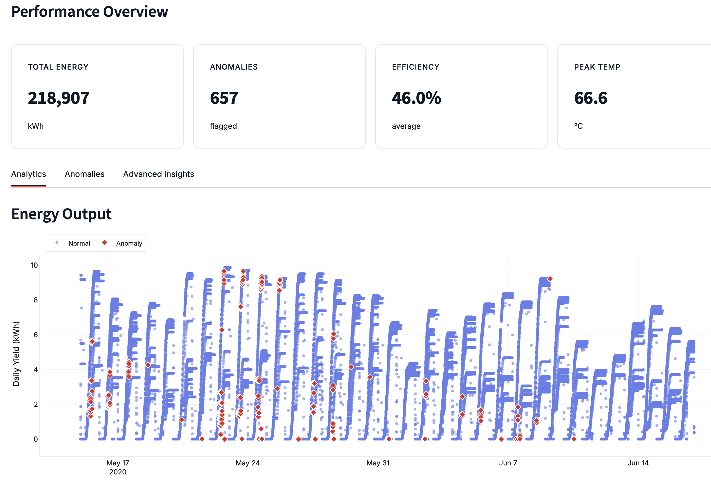
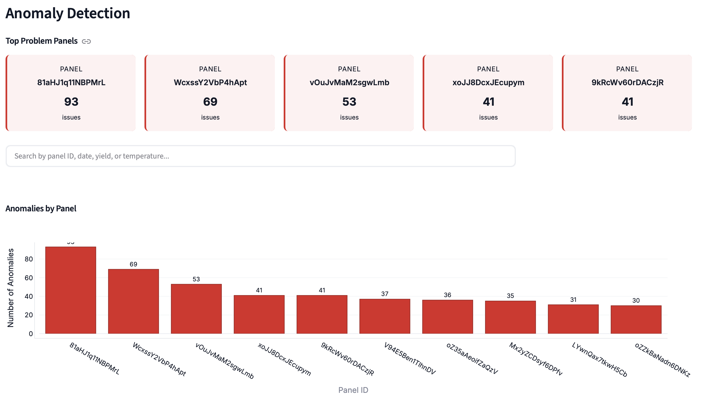
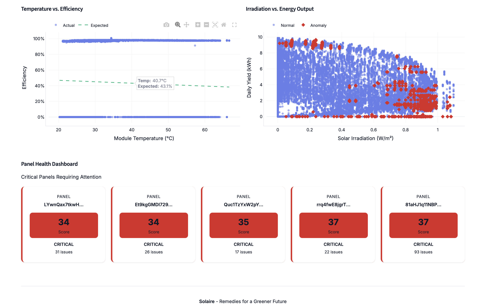
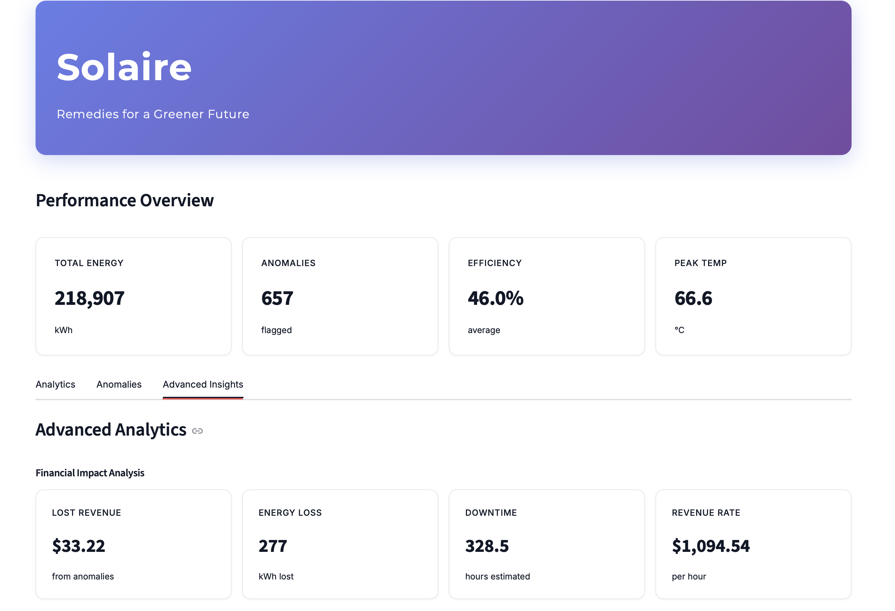
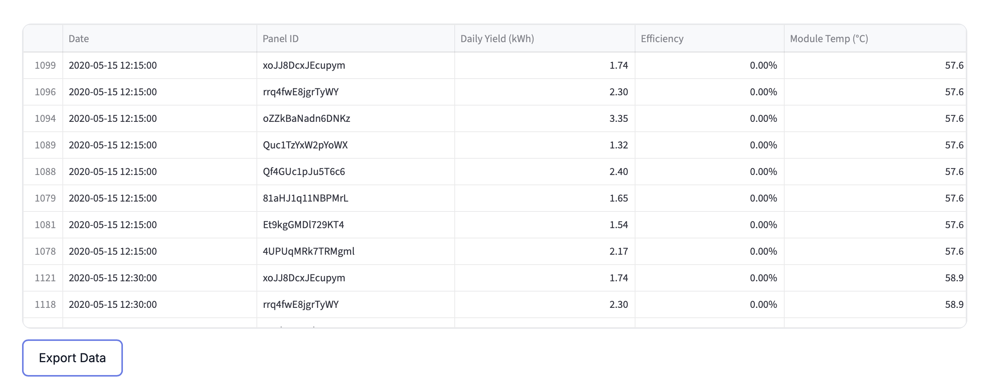
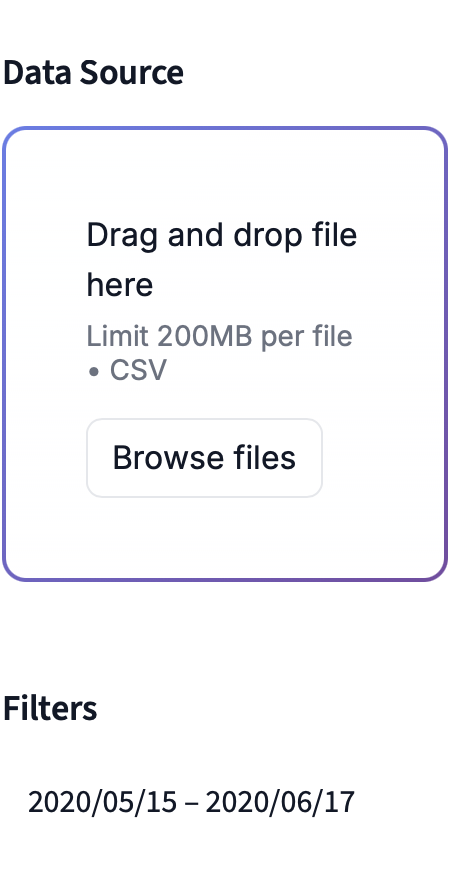

# Full Stack Machine Learning Application | Data Analytics Platform
Machine learning & AI-powered solar energy monitoring dashboard that automatically detects panel anomalies, analyzes performance, and alerts technicians in real-time.

## ML Problem:
Workflow Pain Point: Manually predicting energy output and identifying abnormal patterns in solar data is time consuming and error-prone. Automating this process will conserve time and allow teams to be proactive by predicting potential maintenance issues and forecast energy distribution in advance. Insights will be localized to a dashboard for all team members to access so data analysts can save time explaining discrepencies to other teams.

## Use Cases
 
**Preventive Maintenance:** Identify failing panels before major loss  
**Performance Benchmarking:** Compare panels and track degradation  
**Financial Tracking:** Quantify revenue impact of equipment issues  
**Technician Alerts:** Automated work order triggers  
**Compliance:** Audit trail of system performance

## Tech Stack
 
| Component | Technology |
|-----------|-----------|
| **Frontend** | Streamlit (Python) |
| **ML Model** | Scikit-learn (Isolation Forest) |
| **Data Processing** | Pandas |
| **Visualization** | Plotly |
| **Alerts** | Slack API, Gmail SMTP |
| **Cloud Storage** | Google Drive |## Input Data: 
| **UI Prototype** | Figma

## Input Data
Cleaned plant energy generation and weather data CSV: Time series csv with daily energy output with dates

## Expected Output:
Indicators for each days output labeling it as either normal or anomalous then alerting technicians and drafting a summary of output performance.

### Outputs the User Sees
- **Anomaly labels and Performance Overview - KPIs: data points are marked as normal or anomalous.**

- **Anomalous Panel ID's and number of issues**
 

- **Visuals: Scatterplot shows anomalies, line plot of daily yield, histogram of efficiency, and panel health**

- **Financial Insights: Lost Revenue, Energy loss, Revenue rate, & Downtime**

- **CSV output: Final dataset with predictions and summary (`final_output_with_summary.csv`).**
- **Text summary: Performance summary explaining trends and detected anomalies (`weekly_summary.txt`).**

### Workflow: What It Does
Uses ML to detect abnormal patterns in solar panel data. It analyzes efficiency, temp, and irradiance (sunlight), to automatically flag days with abnormal output. Its purpose is to replace manual data analysis with a faster, more accurate system that identifies potential issues and summarizes performance. It will eventually be used to alert technicians when a problem occurs so they can fix it immediately. 

## Model & Metrics Used
Isolation Forest model for anomaly detection; found outliers without labels →  tested different parameters to see which one flagged the lowest-efficiency points.

## Metric: 
Average efficiency of flagged anomalies (AC/DC power ratio) → model flags low-efficiency points as anomalies.
cont.: loop through different parameters and calculate mean EFFICIENCY of the detected anomalies. Lower = better (anomalies should be inefficient).

## Used streamlit to export my code and create an interactive dashboard that includes:
1. Anomaly Log (searchable by date and panel #) 

2. Alert Log (searchable by date and panel #)
3. CSV upload & Filter button 

4. Chart of Energy output overtime:interactive so you can see the details of each anomaly and the date they occurred and download if needed.
5. KPIs for CSV uploaded inc. Total energy, Max Module Temp, Avg Efficiency, Anomalies Flagged
6. Weekly Summary of Performance based on weather data and energy generation
7. Button to download anomalies
8. Trademark and Brand Name
9. Tabs to switch between summary/charts to searchable alert and anomaly log

## Zapier to automate alerts and notifications.
Created a Zapier flow that monitors my Google Drive for updated alerts_summary_only.csv files.
--> Sends  email alert when a new summary is detected, auto-fills body with these metrics:
Output (kWh)
Average Efficiency
Max Module Temp

##
- Refine UI to look like figma base and add features
- Login system not created yet

**Remedies for a Greener Future**
